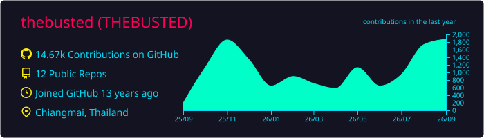
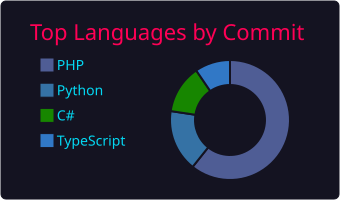
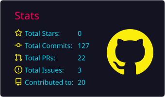
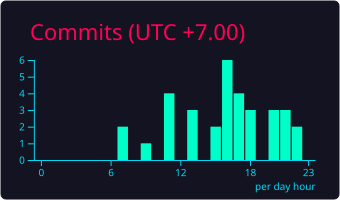

<!-- BANNER -->
<div align="center">


</div>

<!-- TAGLINE -->
<div align="center">

<a href="https://github.com/thebusted">
  
</a>

</div>

<br />

## 🟢 now running

| stream | what i'm operating | repos |
| :--- | :--- | :--- |
| 📈 **trading** | gold-sigtrader (MT5 scanners) · liq-signal (Polymarket → Redis → maker bot) · poly-arb | [quantagent](https://github.com/thebusted/quantagent) |
| 🤝 **clients** | UK sports-betting volume pipeline · thai school SaaS · various contract work | private |
| 🛠️ **products** | asset management · real-estate content engine · vehicle tag IDs | [baanrow.com](https://baanrow.com) |
| 🧠 **infra** | memsudo (personal palace) · Oracle (186 repos · MCP memory) · ~100 Claude Code skills | [memsudo](https://github.com/thebusted/memsudo) · [oracle-v2](https://github.com/thebusted/oracle-v2) |

## 🚀 open source

things i've shipped that you can clone right now.

| repo | what it is |
| :--- | :--- |
| [memsudo](https://github.com/thebusted/memsudo) | memory palace CLI — markdown second-brain, zero deps |
| [oracle-v2](https://github.com/thebusted/oracle-v2) | MCP memory layer w/ semantic search + supersession + philosophy |
| [oh-my-claudecode](https://github.com/thebusted/oh-my-claudecode) | teams-first multi-agent orchestration for Claude Code |
| [claude-code-solutions](https://github.com/thebusted/claude-code-solutions) | fix the 5 problems every Claude Code dev hits — free skills + solutions pack |
| [mcp-mysql-server](https://github.com/thebusted/mcp-mysql-server) | MCP server for MySQL — AI tools can query your DB safely |
| [SSH-MCP](https://github.com/thebusted/SSH-MCP) | MCP server for SSH — Claude Desktop / VS Code → your VPS |

## 🪄 claude code skills (some of mine)

```bash
/boris-workflow   # plan-first dev — research → annotate → implement gates
/forward          # session handoff + memory carry to next conversation
/focus            # multi-area work tracker across many parallel streams
/wrap             # autonomous end-of-session — retro + handoff + commit + push
/recap            # session orientation when you've lost the thread
/orchestrator     # opus dispatches codex + gemini workers in parallel tmux
/kwang-style      # voice/copy discipline — Stuart-Mirror as default
/standup          # daily standup — pending tasks, appointments, recent progress
/trace            # find projects across git history + repos + Oracle vault
/dig              # mine Claude Code sessions — timeline, gaps, attribution
/xray             # introspect memory + installed skills + session history
/watch            # learn from YouTube via Gemini transcription
# ...100+ more in the palace
```

## 🔧 stack


## 🔭 exploring

- **MCP servers as the new SDK** — building three of my own (memory, SSH, MySQL); convinced this is the API surface AI eats next
- **agentic evals across platforms** — Turing, Outlier, Apron — what gets graded teaches what to ship
- **multi-timeframe gold quant** — Fisher + SuperTrend + HTF key-level confluence on MT5, signals streamed to LINE

## 📊 github

<div align="center">




<br />




</div>

## 🐍 lately

<div align="center">


</div>

## 📡 reach

<div align="center">

<a href="mailto:tksumeth@gmail.com"></a>
<a href="https://me.ggez.work"></a>
<a href="https://github.com/thebusted"></a>

</div>

<br />

<div align="center">

<sub><em>พลาดได้ แต่ต้องกลับมาได้.</em></sub>


</div>
